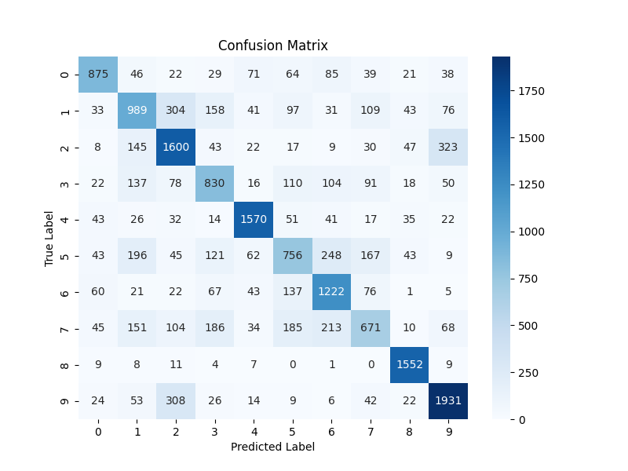
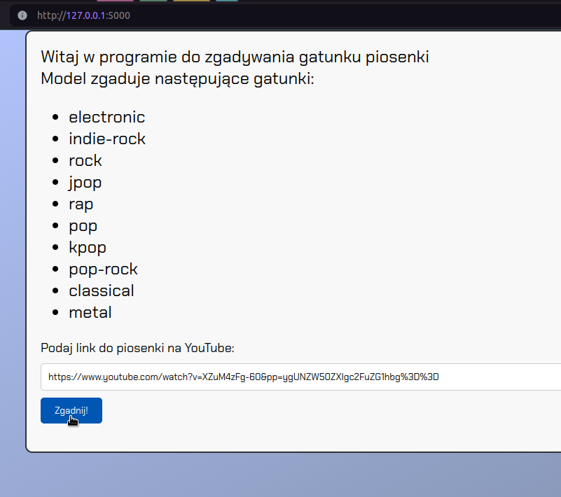

Genres dataset:

All songs from the following playlists (access may 2024)  
https://open.spotify.com/playlist/37i9dQZF1DX1lU51fgoMhF  
https://open.spotify.com/playlist/37i9dQZF1DWWOaP4H0w5b0  
https://open.spotify.com/playlist/37i9dQZF1DX76t638V6CA8  
https://open.spotify.com/playlist/37i9dQZF1DWUa8ZRTfalHk
https://open.spotify.com/playlist/37i9dQZF1DWXRqgorJj26U?si=3617dde5f1c54955  
https://open.spotify.com/playlist/37i9dQZF1DXatFAWyNT5ad?si=4f3d9fdb4eec4556  
https://open.spotify.com/playlist/37i9dQZF1DXdbRLJPSmnyq?si=a7317c6426f84977  
https://open.spotify.com/playlist/37i9dQZF1DXb9izPIc0SCS?si=59cf01b1d88b4a7a  
https://open.spotify.com/playlist/37i9dQZF1DX4eRPd9frC1m?si=4b7e8c0bdcd44569  
https://open.spotify.com/playlist/37i9dQZF1DWV0gynK7G6pD?si=bb580d12851d4010  

Each playlist contains 100 songs. The songs were divided into 30-seconds  segments, which results in 700-900 items per genre

## Tutorials: ##
Preprocessing audio data for Deep Learning:  
https://www.youtube.com/watch?v=Oa_d-zaUti8&list=PL-wATfeyAMNrtbkCNsLcpoAyBBRJZVlnf&index=11

A CNN network for music genre classification:  
https://www.youtube.com/watch?v=dOG-HxpbMSw&list=PL-wATfeyAMNrtbkCNsLcpoAyBBRJZVlnf&index=16

## Results
model.h5 - 100 epok po 1 piosence  
model2.h5 - 1000 epok po 1 piosence  
model3.h5 - 100 epok po 100 piosenek  
#### Dla 4 gatunków:
model4.h5 - 400 epok po 100 piosenek  - 60% dokladnosc  
model6.h5 - 400 epok po 5 piosenek - 65% dokladnosc  
model7.h5 - 2000 epok po 5 piosenek - 72% dokladnosc

cnn_model3 - 3000 epok po 5 piosenek - 84% dokladność  
cnn_model4 - 100 epok po 100 piosenek - 75% dokladność  
cnn_model6 - 300 epok po 100 piosenek - 83% dokładność  
**cnn_model7 - 100 epok po 100 piosenek - 83% dokładność**

#### Dla 10 gatunków:
**cnn_model8 - 100 epok po 100 piosenek - 67,5% dokładność**

## Dokumentacja

* Aby trenować model, nalezy wejść do folderu genres_recognition/src.  
* W folderze proj1 należy utworzyć podfolder genres_dataset, oraz tam umieścić foldery o nazwach odpowiadającym
gatunkom muzycznym, zawierające pliki mp3 z utworami podzielonymi na 30 sekundowe fragmenty.  

#### Frontend
* Należy wejść do folderu genres_front/src oraz uruchomić plik server.py,
 wcześniej instalując wszystkie zależności.
* Wejść na adres localhost wyświetlony w terminalu
* Otwiera się interfejs interakcji z modelem. Wklejamy link do piosenki
w serwisie YouTube, a model podaje prawdpodobieństwo należenia utworu
do danego gatunku.
* Czasami pojawia się problem z konwersją danych, wtedy najlepiej podać
inny link do tego samego utworu.

### Metoda pozwalajaca na szybsze użycie modelu na większej ilości utworów jednocześnie
* W katalogu genres_recognition nalezy utworzyć folder data_to_predict, a w nim dowolny folder. W tym dowolnym folderze możemy umieścić dowolną ilość plików mp3.
* Następnie wchodzimy w katalog /proj1/genres_recognition/src oraz uruchomiamy skrypt process_data_to_predict.py. Nalezy pamiętać, aby ustawić nazwę folderu na nasz wcześniej utworzony folder. Skrypt ten utworzy w folderze data_to_predict folder zawierający nasze piosenki przekonwertowane na dane liczbowe rozumiane przez model.
* Następnie będąc dalej w folderze src uruchamiamy skrypt predict_multiple.py, który w konsoli wyświetli nam predykcje dla każdego utworu zawartego w folderze. Nalży upewnić się, że skrypt przyjmuje prawidłowy folder z plikami json, oraz prawidłowy model (zawierający się w katalogu genres_recognition/models)
* Należy również pamiętać, czy plik predict przyjmuje odpowiednie etykiety,
tzn czy tablica `mapping` zawiera prawidłowe gatunki