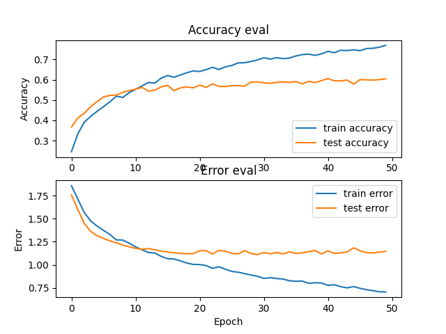
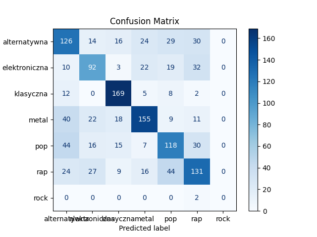

Zbiór danych:

Utwory z poniższych playlist - lekko zmodyfikowane - dostęp czerwiec 2024  
https://open.spotify.com/playlist/37i9dQZF1DWWOaP4H0w5b0  
https://open.spotify.com/playlist/37i9dQZF1DX76t638V6CA8  
https://open.spotify.com/playlist/37i9dQZF1DWUa8ZRTfalHk  
https://open.spotify.com/playlist/37i9dQZF1DWXRqgorJj26U?si=3617dde5f1c54955  
https://open.spotify.com/playlist/37i9dQZF1DXb9izPIc0SCS?si=59cf01b1d88b4a7a  
https://open.spotify.com/playlist/37i9dQZF1DX4eRPd9frC1m?si=4b7e8c0bdcd44569  
https://open.spotify.com/playlist/37i9dQZF1DWV0gynK7G6pD?si=bb580d12851d4010  


Każda z playlist zawiera około 100 utworów.


## Poradniki: ##
Preprocessing audio data for Deep Learning:  
https://www.youtube.com/watch?v=Oa_d-zaUti8&list=PL-wATfeyAMNrtbkCNsLcpoAyBBRJZVlnf&index=11

An RNN-LSTM Network for Music Genre Classification:  
https://www.youtube.com/watch?v=4nXI0h2sq2I&list=PL-wATfeyAMNrtbkCNsLcpoAyBBRJZVlnf&index=19

Powyższe 2 video to najważniejsze elementy wykorzystane w projekcie, ale cały kurs jest warty uwagi

## Wyniki
```
    model = keras.Sequential()

    # 2 LSTM layers
    model.add(keras.layers.LSTM(64, input_shape=input_shape, return_sequences=True))
    model.add(keras.layers.LSTM(64))

    # dense layer
    model.add(keras.layers.Dense(64, activation='relu'))
    model.add(keras.layers.Dropout(0.3))

    # output layer
    model.add(keras.layers.Dense(len(GENRE_LABELS), activation='softmax'))

    return model
```

  
  


## Dokumentacja

### Trening
* Aby trenować model, nalezy wejść do folderu genres_recognition/src.  
* W folderze proj1 należy utworzyć podfolder genres_dataset, oraz tam umieścić foldery o nazwach odpowiadającym
gatunkom muzycznym, zawierające pliki mp3 z utworami podzielonymi na 30 sekundowe fragmenty.  


### Predykcja
* W katalogu genres_recognition nalezy utworzyć folder data_to_predict, a w nim dowolny folder. W tym dowolnym folderze możemy umieścić dowolną ilość plików mp3.
* Następnie wchodzimy w katalog /proj1/genres_recognition/src oraz uruchomiamy skrypt process_data_to_predict.py. Nalezy pamiętać, aby ustawić nazwę folderu na nasz wcześniej utworzony folder. Skrypt ten utworzy w folderze data_to_predict folder zawierający nasze piosenki przekonwertowane na dane liczbowe rozumiane przez model.
* Następnie będąc dalej w folderze src uruchamiamy skrypt predict_multiple.py, który w konsoli wyświetli nam predykcje dla każdego utworu zawartego w folderze. Nalży upewnić się, że skrypt przyjmuje prawidłowy folder z plikami json, oraz prawidłowy model (zawierający się w katalogu genres_recognition/models)
* Należy również pamiętać, czy plik predict przyjmuje odpowiednie etykiety,
tzn czy tablica `mapping` zawiera prawidłowe gatunki